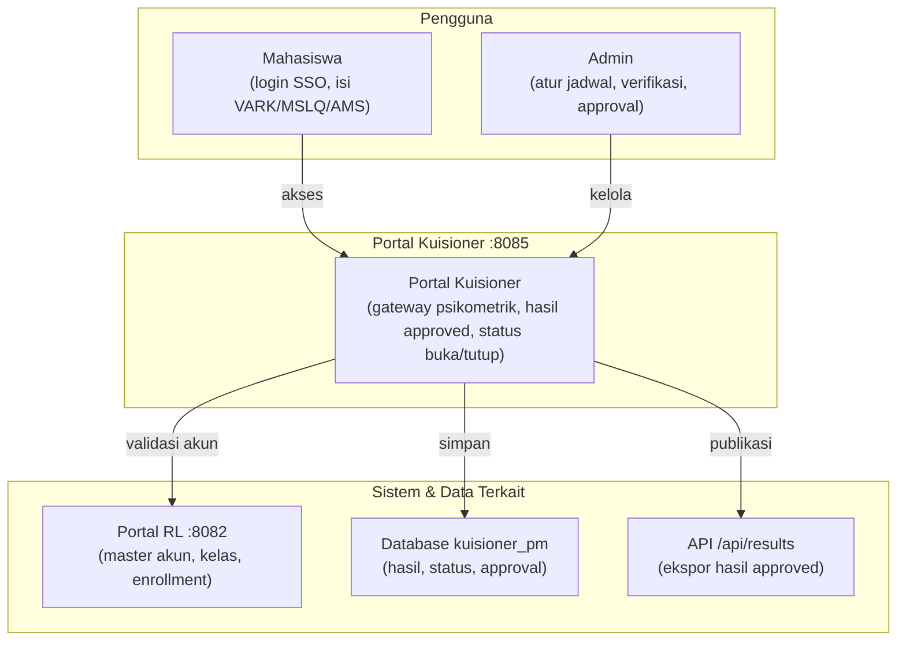
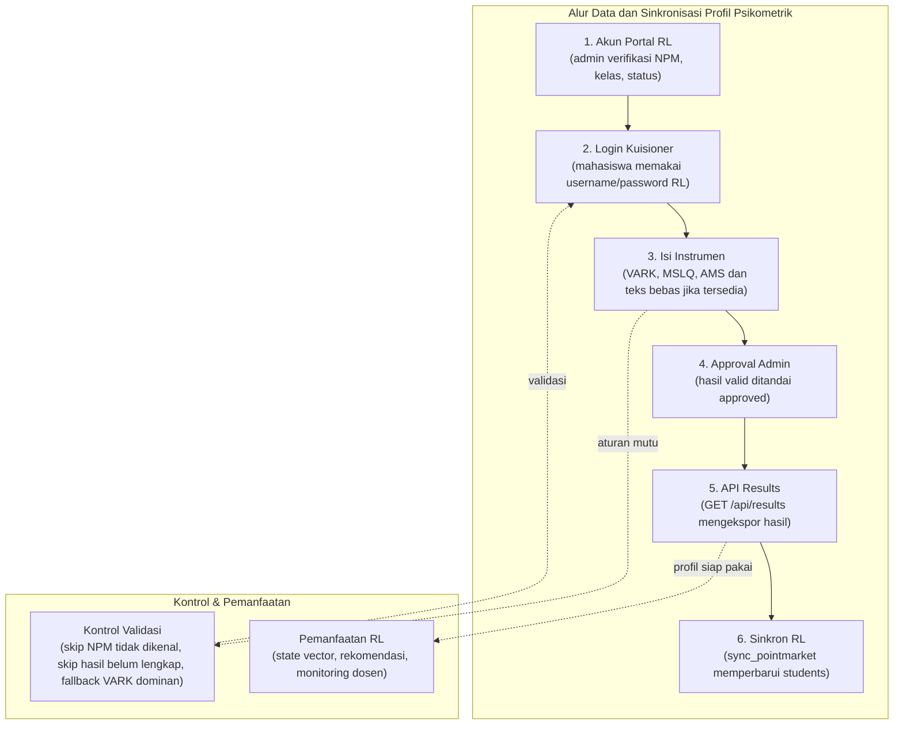
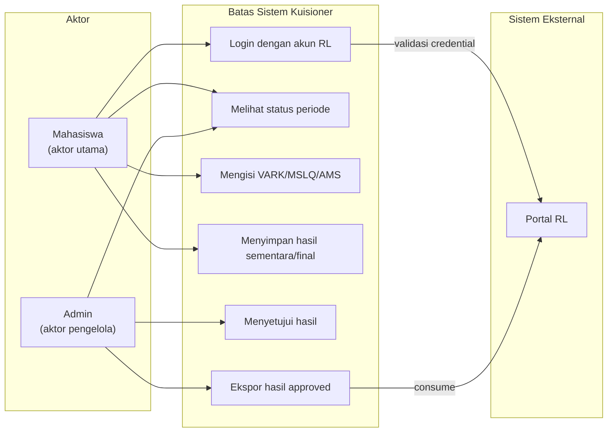

# SOFTWARE REQUIREMENTS SPECIFICATION
## Platform PointMarket Kuisioner Psikometrik

| Atribut | Nilai |
| --- | --- |
| **Nama Dokumen** | Software Requirements Specification (SRS) Platform PointMarket Kuisioner Psikometrik |
| **Versi** | 2.0 - Professional Requirements Baseline |
| **Tanggal** | 14 June 2026 |
| **Sistem** | POINTMARKET Psychometric Gateway / Portal Kuesioner PM |
| **Pemilik Produk** | Lab Riset PM / PointMarket RL Ecosystem |
| **Target Pembaca** | Product owner, developer, QA engineer, maintainer, peneliti sistem, dan administrator operasional |
| **Status** | Dokumen kerja untuk baseline requirement dan validasi implementasi |

### Basis Penyusunan
SRS ini disusun dari kode dan konfigurasi aplikasi kuisioner yang aktif: pola MVC pada `app/Controllers`, `app/Models`, dan `app/Views`; skema database `kuisioner_pm`; OpenAPI pada `dev-resources/docs/swagger.yaml`; konfigurasi Docker; serta kontrak integrasi dengan Portal RL PointMarket. Struktur dokumen mengikuti pola SRS yang lazim digunakan tim engineering: tujuan, scope, konteks sistem, aktor, constraint, kebutuhan spesifik, interface, data, business rules, risiko, acceptance criteria, dan traceability.

---

## Daftar Isi

| Bagian | Isi |
| --- | --- |
| 1 | Pendahuluan dan Konteks Dokumen |
| 2 | Gambaran Produk dan Batas Sistem |
| 3 | Konteks Operasional dan Arsitektur |
| 4 | Domain Data dan Aturan Bisnis |
| 5 | Kebutuhan Fungsional |
| 6 | Kebutuhan Non-Fungsional |
| 7 | Antarmuka Eksternal |
| 8 | Workflow Operasional |
| 9 | Risiko, Kontrol, dan Acceptance Criteria |
| 10 | Matriks Ketertelusuran |
| Lampiran | Glosarium, Referensi Internal, dan Catatan Implementasi |

---

## 1. Pendahuluan dan Konteks Dokumen

### 1.1 Tujuan Dokumen
Dokumen ini mendefinisikan kebutuhan perangkat lunak untuk PointMarket Kuisioner Psikometrik sebagai komponen operasional dalam ekosistem PointMarket RL.

SRS ini berfungsi sebagai baseline bersama antara pemilik produk, pengembang, penguji, dan pengelola sistem. Dokumen tidak dimaksudkan sebagai uraian konseptual, melainkan sebagai spesifikasi yang menerjemahkan perilaku aplikasi ke dalam kebutuhan yang dapat dibangun, diuji, dan dipelihara. Setiap kebutuhan dirumuskan agar memiliki ruang lingkup yang jelas, dasar implementasi yang dapat ditelusuri, dan kriteria penerimaan yang dapat diverifikasi.

Rujukan format yang digunakan adalah praktik SRS yang umum dipakai di lingkungan pengembangan perangkat lunak: dokumen dimulai dari tujuan dan scope, dilanjutkan dengan product perspective, user classes, constraints, asumsi, kebutuhan fungsional, kebutuhan non-fungsional, external interfaces, data requirements, business rules, acceptance criteria, dan traceability matrix. Dengan struktur tersebut, dokumen dapat dipakai sebagai kontrak kerja teknis tanpa bergantung pada penjelasan lisan.

### 1.2 Ruang Lingkup Produk
PointMarket Kuisioner Psikometrik adalah gateway asesmen yang mengumpulkan, mengolah, dan mengekspos profil psikometrik mahasiswa untuk kebutuhan personalisasi pembelajaran pada Portal RL PointMarket. Profil yang dikelola meliputi preferensi belajar VARK, skor strategi/motivasi belajar MSLQ, dan orientasi motivasi akademik AMS. Sistem berjalan sebagai aplikasi web PHP berbasis MVC dengan database MySQL dan deployment Docker.

Dalam arsitektur ekosistem, Portal RL tetap menjadi system of record untuk akun, kelas, plotting, dan enrollment. Portal kuisioner tidak mengambil alih fungsi master data tersebut. Sistem kuisioner bertanggung jawab pada siklus asesmen: validasi akses, pengisian instrumen, perhitungan hasil, approval, monitoring kelengkapan, pengaturan periode, dan penyediaan hasil approved melalui API.

### 1.3 Out of Scope
Dokumen ini tidak menspesifikasikan algoritma reinforcement learning pada Portal RL, mekanisme penilaian aktivitas belajar di Portal RL, ataupun manajemen kelas sebagai fungsi utama portal kuisioner. Perubahan akun, kelas, kontak, dan status mahasiswa tetap diarahkan ke Portal RL agar tidak terjadi dual ownership data.

| Area | Status Scope | Rasional |
| --- | --- | --- |
| **Pembuatan akun mahasiswa mandiri** | Di luar scope | Akun mahasiswa dibuat dan diverifikasi dari Portal RL. Portal kuisioner hanya menerima login dari akun yang valid. |
| **Edit kelas dan enrollment** | Di luar scope | Kelas merupakan master data Portal RL. Portal kuisioner hanya menyimpan salinan referensi untuk monitoring kelengkapan kuisioner. |
| **RL decision service** | Di luar scope | Model RL mengonsumsi hasil psikometrik, tetapi proses policy/action/reward dikelola oleh service PointMarket RL. |
| **Bank soal VARK, MSLQ, AMS** | Di dalam scope | Admin kuisioner mengelola instrumen yang dipakai untuk menghasilkan profil psikometrik. |
| **Public API hasil approved** | Di dalam scope | Endpoint `/api/results` adalah kontrak integrasi utama untuk konsumsi Portal RL. |

---

## 2. Gambaran Produk dan Batas Sistem

### 2.1 Product Perspective
Aplikasi ini menempati posisi sebagai psychometric gateway dalam ekosistem PointMarket. Secara teknis, aplikasi berdiri pada port 8085, memiliki database MySQL sendiri bernama `kuisioner_pm`, dan menyajikan API publik untuk hasil kuisioner yang sudah disetujui. Portal RL berjalan terpisah pada port 8082 dan bertindak sebagai sumber otoritatif untuk akun, kelas, dan enrollment.


*Gambar 1. Konteks sistem dan batas tanggung jawab PointMarket Kuisioner Psikometrik.*

### 2.2 User Classes dan Karakteristik
Sistem melayani beberapa kelas pengguna dengan hak dan ekspektasi yang berbeda. Kebutuhan sistem harus menjaga perbedaan tersebut agar data psikometrik dapat dikumpulkan tanpa mengacaukan master data Portal RL.

| User Class | Tanggung Jawab | Ekspektasi Sistem | Kontrol Akses |
| --- | --- | --- | --- |
| **Mahasiswa** | Mengisi instrumen VARK, MSLQ, dan AMS menggunakan akun Portal RL. | Login sederhana, status periode jelas, form dapat diselesaikan tanpa kehilangan jawaban. | Session mahasiswa; tidak dapat mengubah NPM, kelas, atau status. |
| **Admin Kuisioner** | Mengelola periode, bank soal, approval, dashboard, dan ekspor hasil. | UI operasional lengkap, data terpaginasikan, notifikasi status integrasi terlihat. | Session admin melalui `/admin/login`. |
| **Admin Portal RL** | Mengelola akun, kelas, plotting, enrollment, dan menarik hasil kuisioner. | API kuisioner konsisten dan tidak membuat data master baru secara liar. | Akses melalui Portal RL, bukan melalui portal kuisioner. |
| **Dosen/Peneliti** | Memantau kelengkapan profil dan menggunakan hasil sebagai baseline analisis. | Status kelas dan data psikometrik dapat ditafsirkan secara agregat. | Akses tidak langsung melalui dashboard Portal RL atau laporan admin. |
| **Sistem Integrasi** | Membaca hasil approved untuk sinkronisasi. | Kontrak JSON stabil, fallback VARK tersedia, error API deterministik. | GET `/api/results`; saat ini endpoint tidak memakai API key. |

### 2.3 Operating Environment
| Komponen | Spesifikasi Saat Ini | Implikasi Requirement |
| --- | --- | --- |
| **Runtime aplikasi** | PHP MVC custom pada container app, port host 8085. | Routing harus konsisten melalui `public/index.php` dan controller terkait. |
| **Database** | MySQL 8.0, database `kuisioner_pm`, port host 3308. | Skema data harus menjaga hasil asesmen, response, history, setting, admin, students, dan classes. |
| **Admin database** | phpMyAdmin pada port 8086. | Akses hanya untuk manajemen teknis; bukan antarmuka operasional utama. |
| **Integrasi Portal RL** | `host.docker.internal:8082` dan database `pointmarket` pada host port 3306. | Koneksi eksternal harus gagal secara terkendali dan tidak merusak data lokal. |
| **Dokumentasi API** | Swagger UI di `/api/docs`, spec di `/api/spec`. | Endpoint publik harus terdokumentasi dan dapat diuji ulang. |

---

## 3. Konteks Operasional dan Arsitektur

### 3.1 Architectural Overview
Aplikasi menggunakan pola Model-View-Controller. Controller menangani alur request seperti login, pengisian instrumen, admin dashboard, settings, dan API. Model membungkus akses database untuk mahasiswa, pertanyaan, setting, dan kelas. View menyajikan halaman mahasiswa, dashboard, admin, bank soal, dan dokumentasi API. Router melakukan pemetaan URL dinamis ke controller dan method.

| Lapisan | Artefak Utama | Tanggung Jawab |
| --- | --- | --- |
| **Routing** | `app/Core/Router.php`, `public/index.php` | Mengarahkan URL ke controller dan method yang sesuai. |
| **Controller** | `HomeController`, `VarkController`, `MslqController`, `AmsController`, `AdminController`, `ApiController` | Mengendalikan session, validasi akses, proses submit, redirect, dan response API. |
| **Model** | `Student`, `Question`, `Setting`, `ClassModel` | Mengelola query database, perhitungan skor, sinkronisasi Portal RL, dan status sistem. |
| **View** | `app/Views/*` | Menyajikan UI mahasiswa, admin, dashboard, settings, bank soal, dan API docs. |
| **Helper** | `VarkNlpHelper` | Menggabungkan hasil VARK self-report dengan narasi teks menggunakan keyword scoring dan weighting. |

### 3.2 Data Flow
Alur utama dimulai dari akun mahasiswa yang dikelola Portal RL. Saat mahasiswa login ke portal kuisioner, sistem memvalidasi kredensial terhadap data lokal atau Portal RL. Jika akun Portal RL valid dan belum ada secara lokal, portal kuisioner membuat atau memperbarui salinan akun lokal dengan status approved. Setelah itu mahasiswa mengisi instrumen sesuai status periode yang sedang dibuka.


*Gambar 2. Alur data dari validasi akun sampai ekspor hasil approved.*

Setiap jawaban disimpan sebagai response terbaru per instrumen dan per pertanyaan. Untuk VARK, sistem menghitung dominasi jawaban dan dapat menggabungkannya dengan narasi teks menggunakan bobot adaptif. Untuk MSLQ, sistem menghitung rata-rata jawaban numerik terbaru. Untuk AMS, sistem memilih kategori dengan rata-rata skor tertinggi. Hasil akhir diperbarui pada record mahasiswa dan diberi timestamp masing-masing instrumen.

---

## 4. Domain Data dan Aturan Bisnis

### 4.1 Core Domain Entities
| Entitas | Deskripsi | Field Penting | Catatan Ownership |
| --- | --- | --- | --- |
| **students** | Salinan lokal peserta dan hasil psikometrik. | `npm`, `nama`, `email`, `kelas`, `password`, `vark_type`, `mslq_score`, `ams_type`, `is_approved`, `*_updated_at` | Identitas berasal dari Portal RL; hasil psikometrik berasal dari portal kuisioner. |
| **responses** | Jawaban mahasiswa terhadap butir instrumen. | `student_id`, `tipe_pertanyaan`, `question_id`, `nilai_jawaban` | Sistem menyimpan jawaban terbaru per soal dengan menghapus jawaban lama untuk soal yang sama. |
| **vark_questions** | Bank soal VARK. | `teks_pertanyaan`, `opt_v`, `opt_a`, `opt_r`, `opt_k` | Dikelola admin kuisioner. |
| **mslq_questions** | Bank soal MSLQ. | `teks_pertanyaan`, `dimensi` | Dikelola admin kuisioner. |
| **ams_questions** | Bank soal AMS. | `teks_pertanyaan`, `kategori` | Dikelola admin kuisioner. |
| **system_settings** | Pengaturan buka/tutup dan parameter keputusan. | `vark_open`, `mslq_open`, `ams_open`, `vark_multimodal_enabled`, `vark_nlp_threshold` | Dibaca oleh portal kuisioner dan banner status Portal RL. |
| **quiz_history** | Riwayat hasil instrumen untuk monitoring. | `student_id`, `quiz_type`, `result_label`, `result_value`, `submitted_at` | Dipakai dashboard admin untuk chart dan activity log. |
| **classes** | Referensi kelas tersinkron. | `class_name`, `description` | Dibaca dari Portal RL; tidak diedit di portal kuisioner. |

### 4.2 Business Rules
Aturan bisnis berikut adalah constraint operasional yang harus dipenuhi agar aplikasi tidak menyimpang dari pembagian tanggung jawab dalam ekosistem PointMarket.

| ID | Aturan Bisnis | Dampak Implementasi |
| --- | --- | --- |
| **BR-01** | Portal RL adalah sumber master akun, kelas, plotting, dan enrollment. | Portal kuisioner tidak menyediakan registrasi mandiri dan menolak perubahan kelas/identitas dari sisi admin kuisioner. |
| **BR-02** | Mahasiswa hanya dapat mengakses instrumen jika memiliki session dan instrumen terkait sedang dibuka. | `VarkController`, `MslqController`, dan `AmsController` harus memeriksa session serta setting `*_open`. |
| **BR-03** | Hasil yang dikonsumsi sistem integrasi harus berasal dari mahasiswa approved. | `/api/results` hanya memilih students dengan `is_approved = 1`. |
| **BR-04** | VARK dapat menghasilkan Multimodal, tetapi integrasi harus tetap memiliki fallback V/A/R/K. | `ApiController` wajib mengirim `vark_dominant_type` sebagai fallback. |
| **BR-05** | MSLQ dihitung dari rata-rata jawaban numerik terbaru per butir. | Penghitungan memakai latest response per `question_id` dan mengabaikan jawaban lama. |
| **BR-06** | AMS dipilih dari kategori dengan rata-rata skor tertinggi. | Model `Student` memilih kategori AMS tertinggi dari jawaban terbaru. |
| **BR-07** | Pengaturan periode dan threshold keputusan adalah konfigurasi operasional. | Admin settings harus menyimpan `opened_at`, `closed_at`, `next_open_at`, dan nilai parameter keputusan. |

---

## 5. Kebutuhan Fungsional

Kebutuhan fungsional ditulis dengan bentuk *shall statement* agar dapat menjadi dasar implementasi dan pengujian. Prioritas **Must** menunjukkan kemampuan inti rilis operasional; **Should** menunjukkan kemampuan penting yang memperkuat operasi; **Could** menunjukkan peningkatan lanjutan.

| ID | Area | Requirement | Priority | Acceptance Criteria |
| --- | --- | --- | --- | --- |
| **FR-01** | Authentication | Sistem *shall* menyediakan login mahasiswa menggunakan NPM/username dan password yang sama dengan Portal RL. | Must | Mahasiswa valid dapat login ke dashboard kuisioner; user invalid menerima pesan gagal yang tidak membocorkan detail database. |
| **FR-02** | Account Sync | Sistem *shall* melakukan upsert akun lokal dari Portal RL saat kredensial valid dan akun lokal belum tersedia atau perlu diperbarui. | Must | Record students lokal berisi NPM, nama, email, kelas, no_hp, password hash lokal, dan `is_approved=1`. |
| **FR-03** | Registration Control | Sistem *shall* menolak pendaftaran mandiri dari portal kuisioner. | Must | Endpoint `/register` menampilkan pesan bahwa akun dibuat melalui Portal RL. |
| **FR-04** | Instrument Availability | Sistem *shall* memeriksa status `vark_open`, `mslq_open`, dan `ams_open` sebelum menampilkan instrumen. | Must | Instrumen tertutup menampilkan closed notice dan tidak menerima submit. |
| **FR-05** | VARK Assessment | Sistem *shall* menyajikan butir VARK dan menyimpan jawaban pilihan V/A/R/K untuk setiap pertanyaan. | Must | Jawaban terbaru per soal tersimpan di responses dengan tipe VARK. |
| **FR-06** | VARK NLP Fusion | Sistem *should* menggabungkan skor VARK self-report dengan narasi teks menggunakan keyword scoring, adaptive weighting, threshold Multimodal, dan konfigurasi admin. | Should | `students.vark_type`, `vark_narrative`, `count V/A/R/K`, skor NLP, dan `vark_updated_at` diperbarui. |
| **FR-07** | MSLQ Assessment | Sistem *shall* menyajikan instrumen MSLQ, menyimpan jawaban numerik, dan menghitung skor rata-rata terbaru. | Must | `students.mslq_score > 0` dan `mslq_updated_at` terisi setelah submit valid. |
| **FR-08** | AMS Assessment | Sistem *shall* menyajikan instrumen AMS, menyimpan jawaban numerik, dan menentukan kategori motivasi dengan rata-rata tertinggi. | Must | `students.ams_type` dan `ams_updated_at` terisi setelah submit valid. |
| **FR-09** | Admin Dashboard | Sistem *shall* menyediakan dashboard admin untuk ringkasan peserta, distribusi VARK/AMS, rata-rata MSLQ, aktivitas terbaru, dan status kelengkapan instrumen. | Must | Halaman `/admin` menampilkan metrik agregat tanpa query manual. |
| **FR-10** | Question Bank Management | Sistem *shall* memungkinkan admin membuat, memperbarui, dan menghapus butir VARK, MSLQ, dan AMS. | Must | Perubahan bank soal tersimpan dan dipakai pada pengisian berikutnya. |
| **FR-11** | Settings Management | Sistem *shall* memungkinkan admin membuka/menutup instrumen, mengatur `next_open_at`, mengubah mode Multimodal, dan threshold VARK NLP. | Must | Perubahan tersimpan di `system_settings` dan terbaca oleh controller serta dashboard. |
| **FR-12** | Class Reference Sync | Sistem *should* menyediakan sinkronisasi referensi kelas dan roster dari Portal RL secara read-only. | Should | Halaman `/admin/classes` menampilkan kelas, active students, missing VARK/MSLQ/AMS, complete students, avg MSLQ, dan last questionnaire time. |
| **FR-13** | Approval Management | Sistem *shall* menyediakan daftar akun pending dan aksi approval untuk data lama atau data yang belum approved. | Must | Admin dapat mengubah `is_approved` menjadi 1 dari `/admin/approvals`. |
| **FR-14** | Public Results API | Sistem *shall* menyediakan GET `/api/results` untuk hasil approved dengan field `npm`, `nama`, `vark_type`, `vark_dominant_type`, `mslq_score`, dan `ams_type`. | Must | Response JSON valid dan diurutkan berdasarkan npm. |
| **FR-15** | API Documentation | Sistem *shall* menyediakan dokumentasi OpenAPI melalui `/api/docs` dan `/api/spec`. | Should | Swagger UI dapat memuat `dev-resources/docs/swagger.yaml`. |
| **FR-16** | Portal RL Status Check | Sistem *should* menyediakan endpoint internal admin untuk mengecek status Portal RL. | Should | `/admin/portal_rl_status` mengembalikan online/offline, `http_code`, `checked_at`, `response_ms`, dan error. |

---

## 6. Kebutuhan Non-Fungsional

Kebutuhan non-fungsional menentukan kualitas sistem yang harus dipenuhi di luar perilaku fitur langsung. Kategori ini penting karena sistem memproses data psikometrik dan menjadi bagian dari pipeline pengambilan keputusan pembelajaran adaptif.

| ID | Quality Attribute | Requirement | Verification |
| --- | --- | --- | --- |
| **NFR-01** | Security | Sistem *shall* menyimpan password lokal dalam bentuk hash dan menggunakan `password_verify` untuk validasi hash. | Audit login; tidak ada password plaintext baru. |
| **NFR-02** | Access Control | Halaman admin *shall* dilindungi session admin, sedangkan halaman instrumen *shall* dilindungi session mahasiswa. | Akses tanpa session diarahkan ke login. |
| **NFR-03** | Data Integrity | Sistem *shall* mempertahankan ownership data: identitas dan kelas dari Portal RL; hasil psikometrik dari portal kuisioner. | Aksi edit identitas/kelas di portal kuisioner ditolak dengan pesan eksplisit. |
| **NFR-04** | Interoperability | API results *shall* mempertahankan kontrak JSON stabil untuk Portal RL. | Consumer lama tetap dapat membaca V/A/R/K melalui `vark_dominant_type`. |
| **NFR-05** | Availability | Aplikasi *shall* dapat dijalankan melalui Docker Compose dengan app, db, dan phpMyAdmin. | `docker-compose.yml` menyediakan port 8085, 3308, dan 8086. |
| **NFR-06** | Failure Handling | Kegagalan koneksi ke Portal RL *shall* menghasilkan status error yang terkendali. | Sync class/status check tidak menghentikan seluruh dashboard. |
| **NFR-07** | Maintainability | Kode *shall* mempertahankan pemisahan MVC sehingga perubahan UI, query, dan flow tidak bercampur. | Controller, model, dan view tetap berada pada direktori masing-masing. |
| **NFR-08** | Auditability | Submit instrumen *should* menulis `quiz_history` untuk kebutuhan monitoring perubahan profil. | Dashboard dapat menampilkan riwayat VARK/MSLQ/AMS terbaru. |
| **NFR-09** | Usability | Form instrumen *should* menampilkan alur yang jelas dan feedback setelah submit. | Pengguna diarahkan kembali ke profile/dashboard dengan pesan sukses. |
| **NFR-10** | Privacy | Data psikometrik *shall* diperlakukan sebagai data terbatas untuk konteks riset dan pembelajaran adaptif. | Hanya admin/session sah dan endpoint hasil approved yang menampilkan data. |

---

## 7. Antarmuka Eksternal

### 7.1 User Interface Requirements
UI harus mendukung pekerjaan operasional yang berulang: mahasiswa menyelesaikan instrumen, admin memantau kelengkapan, dan operator memastikan integrasi dengan Portal RL tetap sehat. Karena itu halaman tidak hanya berfungsi sebagai form, tetapi juga sebagai control surface untuk status, risiko data, dan kesiapan integrasi.

| UI | Primary User | Requirement |
| --- | --- | --- |
| `/` | Publik/internal | Landing page harus menjelaskan fungsi portal sebagai psychometric gateway dan menyediakan akses login mahasiswa, admin, serta API docs. |
| `/home/login_page` | Mahasiswa | Login page harus menyatakan bahwa akun berasal dari Portal RL dan tidak menyediakan registrasi mandiri. |
| `/dashboard/profile` | Mahasiswa | Profile page harus menampilkan status atau hasil VARK, MSLQ, dan AMS yang sudah diselesaikan. |
| `/admin` | Admin | Dashboard harus menampilkan metrik peserta, completion, chart VARK/AMS/MSLQ, status Portal RL, dan aktivitas terbaru. |
| `/admin/settings` | Admin | Settings page harus memungkinkan kontrol periode dan parameter VARK NLP. |
| `/admin/classes` | Admin | Classes page harus read-only terhadap kelas dan fokus pada status kelengkapan kuisioner per kelas. |
| `/admin/vark_nlp_monitor` | Admin | Monitor page harus menampilkan raw VARK, skor NLP, hasil final, dan status Stable/Recalibrated/Multimodal. |

### 7.2 API Requirements
| Endpoint | Method | Consumer | Contract |
| --- | --- | --- | --- |
| `/api/results` | GET | Portal RL / sistem integrasi | Mengembalikan array JSON hasil approved: `npm`, `nama`, `vark_type`, `vark_dominant_type`, `mslq_score`, `ams_type`. |
| `/api/docs` | GET | Developer/admin teknis | Menyajikan Swagger UI berbasis `/api/spec`. |
| `/api/spec` | GET | Developer/admin teknis | Menyajikan OpenAPI YAML dari `dev-resources/docs/swagger.yaml`. |
| `/admin/portal_rl_status` | GET | Dashboard admin | Mengembalikan JSON status koneksi Portal RL untuk health indicator internal. |
| `/admin/sync_classes` | POST | Admin | Menyinkronkan kelas dan roster mahasiswa dari Portal RL, lalu redirect dengan pesan hasil. |

### 7.3 Data Exchange Contract
Kontrak JSON pada `/api/results` harus diperlakukan sebagai public integration contract. Perubahan nama field, tipe data, atau makna nilai dapat memutus proses sinkronisasi di Portal RL. Jika field baru perlu ditambahkan, perubahan harus bersifat backward compatible.

```json
[
  {
    "npm": "24001",
    "nama": "Andi Wijaya",
    "vark_type": "Multimodal",
    "vark_dominant_type": "V",
    "mslq_score": 5.5,
    "ams_type": "achievement"
  }
]
```

---

## 8. Workflow Operasional

Workflow berikut menggambarkan operasi sistem pada kondisi penggunaan nyata. Setiap workflow dapat dijadikan dasar test case end-to-end dan smoke test setelah perubahan fitur.


*Gambar 3. Use case utama dan batas sistem.*

| Workflow | Trigger | Main Success Scenario | Failure/Control |
| --- | --- | --- | --- |
| **Student authentication** | Mahasiswa membuka `/home/login_page`. | Sistem memvalidasi local account; jika belum cocok, sistem mencari akun Portal RL dan melakukan upsert lokal. | Jika Portal RL tidak dapat dihubungi atau kredensial salah, login ditolak tanpa membuat akun. |
| **Instrument submission** | Mahasiswa membuka VARK/MSLQ/AMS yang sedang open. | Sistem menyimpan jawaban terbaru, menghitung hasil, menulis timestamp, dan mencatat history. | Jika instrumen tertutup, sistem menampilkan closed notice. |
| **Admin operational review** | Admin membuka dashboard. | Sistem menampilkan metrik completion, distribusi, riwayat, dan status Portal RL. | Jika Portal RL offline, dashboard tetap berjalan dan menampilkan status offline. |
| **Questionnaire period control** | Admin membuka `/admin/settings`. | Admin mengubah status open/closed, `next_open_at`, multimodal mode, atau threshold. | Perubahan hanya diterapkan pada setting key yang dikenal. |
| **Results integration** | Portal RL atau operator memanggil `/api/results`. | Sistem mengembalikan hasil approved dan fallback VARK dominan. | Jika query gagal, API mengembalikan JSON error dengan status 500. |
| **Class reference synchronization** | Admin menekan sync classes. | Sistem membaca kelas/roster dari Portal RL dan memperbarui salinan lokal. | Kegagalan koneksi menghasilkan pesan error dan tidak mengubah hasil psikometrik. |

---

## 9. Risiko, Kontrol, dan Acceptance Criteria

Karena sistem berada di antara proses asesmen dan mesin personalisasi pembelajaran, risiko utama bukan hanya bug UI, tetapi juga salah ownership data, hasil tidak lengkap yang ikut tersinkron, dan perubahan kontrak API yang tidak kompatibel.

| Risk ID | Risiko | Kontrol Wajib | Acceptance Criteria |
| --- | --- | --- | --- |
| **R-01** | Dual ownership data mahasiswa. | Portal kuisioner menolak perubahan identitas dan kelas; data disinkronkan dari Portal RL. | Aksi edit identitas/kelas tidak mengubah database lokal dan menampilkan pesan penolakan. |
| **R-02** | Hasil kuisioner tidak lengkap masuk ke pipeline RL. | API hanya mengekspor approved; Portal RL juga melakukan validasi `mslq_score` dan field kosong. | `/api/results` tidak mengirim pending user; sinkronisasi RL melewati hasil tidak valid. |
| **R-03** | Multimodal VARK memutus sistem lama yang hanya menerima V/A/R/K. | API selalu mengirim `vark_dominant_type`. | Record Multimodal tetap memiliki fallback dominan berdasarkan count V/A/R/K. |
| **R-04** | Portal RL offline saat login atau sync. | Failure handling dengan pesan error, status card, dan retry manual. | Dashboard admin tetap terbuka; status endpoint mengembalikan offline/error. |
| **R-05** | Threshold NLP tidak terkalibrasi. | Admin settings menyediakan `vark_nlp_threshold` dan monitor NLP. | Admin dapat melihat perbedaan raw/final dan status Stable/Recalibrated/Multimodal. |

---

## 10. Matriks Ketertelusuran

Traceability matrix menghubungkan objective produk dengan requirement dan bukti verifikasi. Matriks ini membantu developer dan QA memastikan perubahan kode tetap menjaga tujuan sistem.

| Objective | Requirement IDs | Evidence / Verification |
| --- | --- | --- |
| Akses mahasiswa mengikuti akun Portal RL. | FR-01, FR-02, FR-03, NFR-02, NFR-03 | Test login akun Portal RL valid, test akun tidak dikenal, test register ditolak. |
| Pengisian instrumen menghasilkan data psikometrik valid. | FR-04, FR-05, FR-06, FR-07, FR-08, NFR-08 | Submit VARK/MSLQ/AMS, periksa students, responses, quiz_history, timestamp. |
| Admin dapat mengendalikan operasi asesmen. | FR-09, FR-10, FR-11, FR-13, FR-16 | Uji dashboard, bank soal, settings, approvals, dan `portal_rl_status`. |
| Portal RL dapat mengonsumsi hasil. | FR-12, FR-14, FR-15, NFR-04 | GET `/api/results`, validasi JSON schema, sync class, sync hasil dari Portal RL. |
| Sistem tetap tangguh saat dependency gagal. | NFR-05, NFR-06, R-04 | Matikan Portal RL/database eksternal, pastikan error terkendali. |

---

## Lampiran A. Glosarium

| Istilah | Definisi Operasional |
| --- | --- |
| **PointMarket RL** | Portal utama yang mengelola akun, kelas, aktivitas belajar, dan integrasi reinforcement learning. |
| **Psychometric Gateway** | Peran portal kuisioner sebagai sumber pengumpulan dan ekspor profil psikometrik. |
| **VARK** | Instrumen preferensi belajar dengan kategori Visual, Aural/Auditory, Read/Write, dan Kinesthetic. |
| **VARK NLP Fusion** | Proses penggabungan jawaban VARK dengan narasi teks berbasis keyword scoring dan adaptive weighting. |
| **MSLQ** | Skor strategi/motivasi belajar yang dihitung sebagai rata-rata jawaban numerik terbaru. |
| **AMS** | Klasifikasi motivasi akademik berdasarkan kategori dengan skor rata-rata tertinggi. |
| **Approved Result** | Record mahasiswa yang disetujui untuk dikonsumsi endpoint integrasi. |
| **System of Record** | Sistem otoritatif untuk satu jenis data. Dalam konteks ini Portal RL adalah system of record untuk akun dan kelas. |

---

## Lampiran B. Referensi Internal

Referensi berikut adalah sumber internal yang digunakan untuk merumuskan SRS ini.

| Artefak | Relevansi |
| --- | --- |
| `README.md` | Deskripsi umum aplikasi, fitur, struktur MVC, teknologi, dan batas penggunaan. |
| `docker-compose.yml` | Lingkungan deployment app, MySQL, dan phpMyAdmin. |
| `database/db_schema.sql` | Struktur tabel inti students, admins, system_settings, questions, dan responses. |
| `app/Controllers/*.php` | Perilaku request, session, submit instrumen, admin, dan API. |
| `app/Models/*.php` | Query database, perhitungan skor, sinkronisasi Portal RL, dan konfigurasi. |
| `app/Helpers/VarkNlpHelper.php` | Algoritma fusion VARK self-report dan narasi teks. |
| `dev-resources/docs/swagger.yaml` | Kontrak API, endpoint admin, schemas, dan deskripsi integrasi. |

---

## Lampiran C. Catatan Perubahan Versi 2.0

Versi ini mengubah dokumen dari gaya ringkasan praktis menjadi SRS profesional. Narasi diperluas, requirement ditulis dalam bentuk *shall statement*, scope dan out-of-scope diperjelas, serta acceptance criteria dan traceability diperkuat agar dokumen dapat dipakai sebagai baseline pengembangan nyata.
